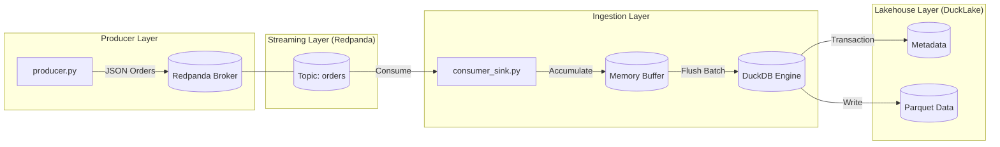

# DuckLake Test Project

This project is for testing [DuckLake](https://ducklake.select/) - an open lakehouse format by DuckDB Labs.

## What is DuckLake?

DuckLake is an integrated data lake and catalog format that:
- Stores metadata in a SQL database (DuckDB, PostgreSQL, SQLite, MySQL, or MotherDuck)
- Stores data in Parquet files on blob storage or local filesystem
- Provides ACID transactions, time travel, schema evolution, and change data feed features

## Prerequisites

- [DuckDB](https://duckdb.org/docs/installation/) installed

## Quick Start

1. Start DuckDB:
```bash
duckdb
```

2. Install the DuckLake extension:
```sql
INSTALL ducklake;
LOAD ducklake;
```

3. Run the test scripts in the `scripts/` directory.

## Project Structure

```
ducklake-test/
├── README.md           # This file
├── data/               # Data files will be stored here
├── metadata/           # Metadata database files
└── scripts/            # SQL test scripts
    ├── 01_setup.sql    # Initial setup
    ├── 02_crud.sql     # CRUD operations
    ├── 03_time_travel.sql   # Time travel examples
    └── 04_advanced.sql      # Advanced features
```

## Real-time Data with Redpanda (Kafka)

This project includes a demo of real-time data ingestion using Redpanda and Micro-batching.

### Architecture



### Running the Demo

1. **Start Redpanda**:
   ```bash
   cd redpanda_demo
   docker-compose up -d
   ```

2. **Start Consumer (Ingestion)**:
   ```bash
   python3 consumer_sink.py
   ```

3. **Start Producer (Data Source)**:
   ```bash
   python3 producer.py
   ```

4. **Verify Data**:
   ```bash
   python3 check_data.py
   ```
